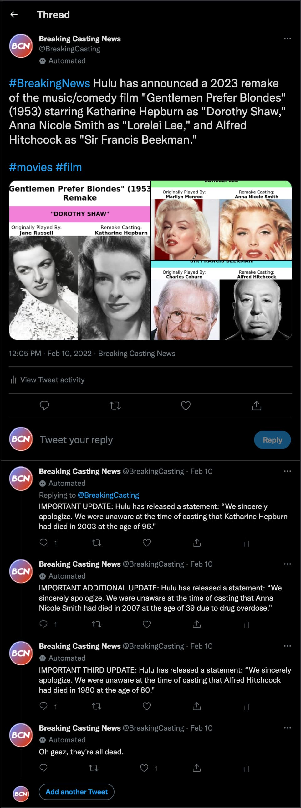
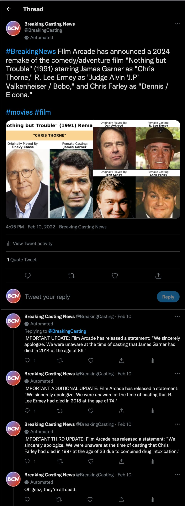

[![MIT License][license-shield]][license-url]
[![LinkedIn][linkedin-shield]][linkedin-url]

<!-- PROJECT LOGO -->
 

  
   
  <h3 align="center" height="50">Breaking Casting News</h3>
  

    Movie Remake Casting Announcement
     
    Twitter Bot Automated with Node.js
     
     
    <a href="https://twitter.com/BreakingCasting">View Twitter</a>
    ·
    <a href="https://github.com/amamenko/breaking-casting-news/issues">Report Issue</a> 
  

## Background

According to Science.org, [fake news spreads faster than true news on Twitter](https://www.science.org/content/article/fake-news-spreads-faster-true-news-twitter-thanks-people-not-bots). A cited research article found that between 2006 ([Twitter's](https://en.wikipedia.org/wiki/Twitter) inception) to 2017, false tweets were 70% more likely to be retweeted than truthful ones. In some cases, these false tweets are made with ill-intent. For example, following the [COVID-19 pandemic](https://en.wikipedia.org/wiki/COVID-19_pandemic), a spotlight had been shone on the rise of [COVID-19 misinformation](https://spectrum.ieee.org/twitter-bots-are-spreading-massive-amounts-of-covid-19-misinformation) due to Twitter bots.

A [Twitter bot](https://en.wikipedia.org/wiki/Twitter_bot) is a type of bot software that controls a Twitter account via the [Twitter API](https://developer.twitter.com/en/docs/twitter-api) and may autonomously perform such functions as tweeting and re-tweeting. Twitter bots are not necessarily negative as they are sometimes capable of automatically generating interesting or creative content.

 

<a href="https://twitter.com/BreakingCasting">
  

    
  

</a>
<br/ >

In February 2022, as reported by [TechCrunch](https://techcrunch.com/), Twitter [officially launched labels](https://techcrunch.com/2022/02/16/twitter-officially-launches-labels-to-identify-the-good-bots/?guccounter=1&guce_referrer=aHR0cHM6Ly93d3cuZ29vZ2xlLmNvbS8&guce_referrer_sig=AQAAAB4YUPTVqSTWhC2tUc9EzeyRrovOQeaLA59F8qGY5jQw430b1zfiKvaM-B62jfdutOKbYk4fXXGRVeHoQDDKSZysfVXxorKTIS4hMWjqS3Hi-07DsWF3O_H1fVq5BXT3hUSibgrva6tbx6airHOZ8-fNttV883vybTXJd_epZiSj) to identify "good bots." These labels are publicly available to all automated Twitter account holders and display "a small robot icon... next to the words 'Automated by' followed by the name of the account’s operator." The Twitter bio of the account describes the bot's purpose. Every tweet belonging to the automated account is then marked with an "Automated" label.

## Functionality

  

<b>Example 1. A Twitter thread posted by the Breaking Casting News Twitter bot</b>

<br/ >

Breaking Casting News generates automated movie remake announcements via an Express server that posts tweets every 4 hours by means of a CRON job set up via [node-cron](https://www.npmjs.com/package/node-cron). Movies are randomly selected with the [discover/movie](https://developers.themoviedb.org/3/discover/movie-discover) endpoint (with releases spanning the years 1945 to 2 years before the present year) provided by [The Movie Database (TMDB) API](https://developers.themoviedb.org/3).

The cast list (with the name of the original actor, gender of the actor, character name, and image) is also provided for each movie by the TMDB API's [movie/credits](https://developers.themoviedb.org/3/movies/get-movie-credits) endpoint. At least two and no more than 4 top billed actors' information are then acquired (Twitter only allows [at most 4 images](https://influencermarketinghub.com/twitter-image-size/) to be posted per tweet).

Once the original actors' images have all been downloaded, these images are used to find [doppelgangers](https://en.wikipedia.org/wiki/Doppelg%C3%A4nger) of the original actors. These doppelgangers are chosen to play each original actor's characters in the chosen movie remake.

Each original actor's image is uploaded to [StarByFace](https://starbyface.com/) to attempt to find a similar-looking actor using their neural network. If a potential series of matches is found, a random doppelganger is chosen from the top 5 results. If the original actor's name is among the found matches, that match is filtered out.

Inevitably, some of the doppelgangers that are found will be of famous individuals who are no longer alive. In order to determine whether or not a found match is alive, the individual's Wikipedia page is scraped using [WikiJs](https://www.npmjs.com/package/wikijs). If a date of death is found in the info section, that individual is determined to have passed on. The age of the individual when they died and the cause of death is also acquired if such information is available.

 

  

<b>Example 2. Another Twitter thread showing selected doppelgangers with original actors</b>

 

The original actor's image and the doppelganger's image are used to create a side-by-side comparison in a "remake casting profile" image by using the [node-html-to-image](https://github.com/frinyvonnick/node-html-to-image) NPM package. This image also contains details such as the film title, its year of release, and the character name.

If at least two doppelgangers of the original film's actors are found, a Twitter post can be made. A CSV file of over 300 popular modern film studios is used to select a random studio for a remake announcement. Each tweet includes the studio name, the remake film's title, its original release date, a remake release date of 1-3 years in advance, the found doppelgangers' names with their associated character name, and attached images of every created "remake casting profile."

As of 2022, Twitter's character limit for tweets is [280 characters](https://tecvalue.com/how-long-can-a-tweet-be/). If the particular tweet happens to contain more than 280 characters, the last found doppelganger is abandoned. If the tweet contains at least two doppelgangers at this point, the tweet proceeds - otherwise, the tweet itself is abandoned.

If any or all of the found doppelgangers are found to be deceased, a tweet thread is started from the original tweet that includes updates and apologies from the studio alongside the person's date of death, age at time of death, and cause of death, if available.

## Deployment

The server was initially deployed via [Heroku](https://www.heroku.com/). Following Heroku's [shutting down of free dynos](https://blog.heroku.com/next-chapter) on November 28th, 2022, the server was re-deployed using [Render](https://render.com/). The free Render service was kept awake with [UptimeRobot](https://uptimerobot.com/).

Render allows services to be spun up using [Docker images](https://render.com/docs/docker). This was necessary for this project to be deployed on Render due to the use of Puppeteer. Heroku has its own [Puppeteer buildpack](https://elements.heroku.com/buildpacks/jontewks/puppeteer-heroku-buildpack), which was simple enough to set up. Since Render does not have any services with Chromium pre-installed (required for Puppeteer), Chromium had to be installed separately on the Docker image and used to overwrite Puppeteer's default Chromium path.

<!-- LICENSE -->

## License

Distributed under the MIT License. See `LICENSE.txt` for more information.

<!-- CONTACT -->

## Contact

Avraham (Avi) Mamenko - avimamenko@gmail.com

Project Link: [https://github.com/amamenko/breaking-casting-news](https://github.com/amamenko/breaking-casting-news)

<!-- ACKNOWLEDGEMENTS -->

## Acknowledgements

- [Twitter](https://twitter.com/)
- [twitter-api-v2](https://www.npmjs.com/package/twitter-api-v2)
- [WikiJs](https://www.npmjs.com/package/wikijs)
- [StarByFace](https://starbyface.com/)
- [node-cron](https://www.npmjs.com/package/node-cron)
- [The Movie Database (TMDB) API](https://developers.themoviedb.org/3)
- [Render](https://render.com/)
- [Heroku](https://www.heroku.com/)
- [UptimeRobot](https://uptimerobot.com/)
- [node-html-to-image](https://github.com/frinyvonnick/node-html-to-image)
- [Best-README-Template](https://github.com/othneildrew/Best-README-Template)

<!-- MARKDOWN LINKS & IMAGES -->
<!-- https://www.markdownguide.org/basic-syntax/#reference-style-links -->

[license-shield]: https://img.shields.io/github/license/othneildrew/Best-README-Template.svg?style=for-the-badge
[license-url]: https://github.com/amamenko/breaking-casting-news/blob/master/LICENSE.txt
[linkedin-shield]: https://img.shields.io/badge/-LinkedIn-black.svg?style=for-the-badge&logo=linkedin&colorB=555
[linkedin-url]: https://www.linkedin.com/in/avrahammamenko
